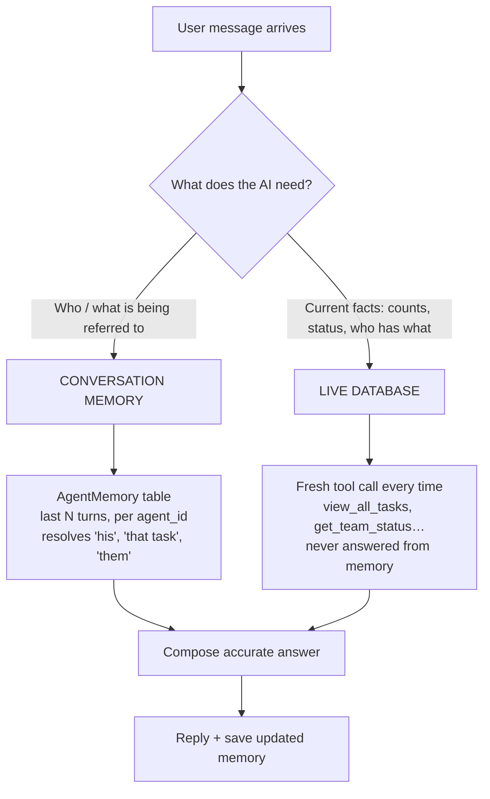
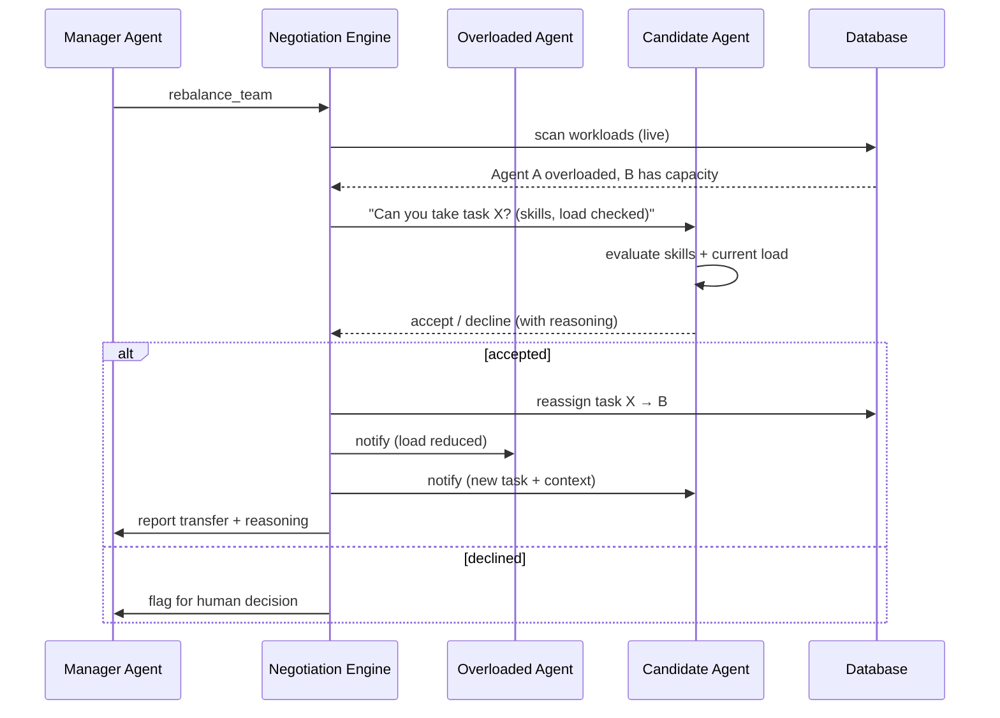
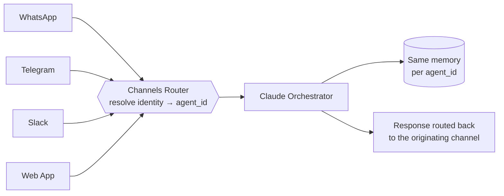
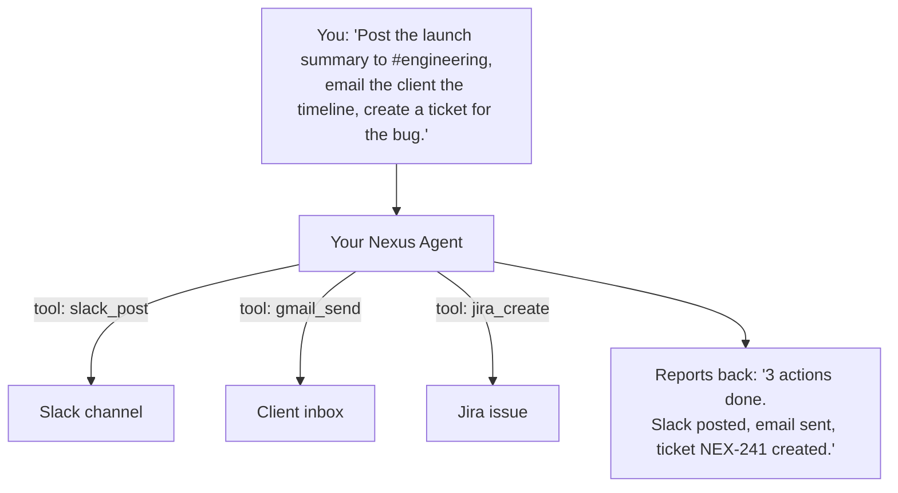

<div align="center">

# ⬡ NEXUS COMMAND

### The AI Operating System for Teams

**Every employee gets their own AI agent. The agents coordinate, negotiate workloads, and act — across every channel your team already uses.**


</div>

---

## What Is Nexus?

Most "AI assistants" for work are a single chatbot bolted onto a company. One brain, one chat window, one place it lives.

**Nexus is different.** It gives **every employee their own AI agent** — a personal operator that knows their work, their tasks, their communication style. When work piles up, those agents **talk to each other** to rebalance the load. A manager watches the whole thing reason in real time through a transparent "Glass Brain," and reaches their agent from **WhatsApp, Slack, Telegram, or the web** — same agent, same memory, wherever they are.

And it's not just a place you visit — it's a layer you **command**. Tell your agent from anywhere: *"post the update in #engineering, email the client the new timeline, and create a ticket for the bug James found"* — and it does all three, across all three tools, without you opening any of them. **Like Claude, built specifically for how enterprises actually work.**

It's not a chatbot. It's an operating system for how a team's work actually flows.

> **Honest framing:** Nexus today is **multi-agent coordination** with real-time AI-to-AI negotiation — not yet a fully autonomous swarm, and not yet a complete control layer across every enterprise tool. Agents act when invoked, negotiate when triggered, and send autonomous morning briefings on a schedule. Acting across external tools (Slack post, Gmail send, Jira create, etc.) is being built one connector at a time. This README is precise about what's working vs. what's coming.

---

## Why Nexus Is Different

Seven things set Nexus apart from every other "AI Chief of Staff" in the market:

| # | Differentiator | What it means |
|---|----------------|---------------|
| 1 | **One AI per employee** | Not one company-wide bot. Every person has a personal agent with its own memory, personality, and tool access. |
| 2 | **AI-to-AI negotiation** | When a workload imbalances, agents negotiate task transfers between themselves before bothering a human. |
| 3 | **Glass Brain transparency** | The AI's reasoning streams live to the manager — you see *how* it decides, not just the answer. |
| 4 | **True omnichannel** | The same agent is reachable from WhatsApp, Slack, Telegram, and web — sharing one continuous memory across all of them. |
| 5 | **Acts across your tools** | Nexus doesn't just read your apps — it acts in them. Post to Slack, send Gmail, schedule a meeting, create a ticket — from one command, across multiple tools, from any channel. |
| 6 | **Live admin circuit board** | A real-time, n8n-style visualization of the entire system: agents, tools, data, events lighting up as they fire. |
| 7 | **Hybrid AI routing** | Each task is routed to the cheapest capable model (Claude Sonnet / Haiku, Gemini, or a free local model), cutting cost without cutting quality. |

---

## System Architecture

```
┌───────────────────────────────────────────────────────────────────────────┐
│                                  CLIENTS                                    │
│                                                                             │
│   Web Browser        WhatsApp          Telegram           Slack DMs         │
│   (React SPA)        (Twilio)          (Bot API)          (Socket Mode)     │
│        │                 │                 │                  │             │
└────────┼─────────────────┼─────────────────┼──────────────────┼────────────┘
         │                 │                 │                  │
         │   HTTPS / WS    │   webhook        │   webhook         │  socket
         ▼                 ▼                 ▼                  ▼
┌───────────────────────────────────────────────────────────────────────────┐
│                            NEXUS BACKEND  (FastAPI + Uvicorn)               │
│                                                                             │
│   ┌──────────────┐  ┌──────────────┐  ┌───────────────┐  ┌──────────────┐  │
│   │   REST API   │  │  WebSocket   │  │  Channels     │  │  Slack Bot   │  │
│   │  /api/v1/*   │  │  room-based  │  │  Router       │  │              │  │
│   │              │  │  Glass Brain │  │  WA/TG/verify │  │              │  │
│   └──────┬───────┘  └──────┬───────┘  └──────┬────────┘  └──────┬───────┘  │
│          │                 │                 │                  │           │
│          └─────────────────┴────────┬────────┴──────────────────┘           │
│                                      ▼                                       │
│                  ┌───────────────────────────────────────┐                  │
│                  │        CLAUDE ORCHESTRATOR             │                  │
│                  │                                        │                  │
│                  │   ┌─────────────────────────────────┐  │                  │
│                  │   │       Hybrid AI Router          │  │                  │
│                  │   │   Sonnet · Haiku · Gemini · LLM │  │                  │
│                  │   └─────────────────────────────────┘  │                  │
│                  │                                        │                  │
│                  │   ~88 Tools  (tasks, employees,        │                  │
│                  │   meetings, Google, memory, peer,      │                  │
│                  │   negotiation, notifications)          │                  │
│                  └──────────────────┬─────────────────────┘                  │
│                                     │                                        │
│   ┌─────────────────┐   ┌───────────┴─────────┐   ┌──────────────────────┐  │
│   │   Negotiation   │   │   Preference        │   │     Event Bus        │  │
│   │   Engine        │   │   Learner           │   │  (live telemetry to  │  │
│   │  (AI-to-AI)     │   │  (behavioral twin)  │   │   admin board)       │  │
│   └─────────────────┘   └─────────────────────┘   └──────────────────────┘  │
│                                     │                                        │
└─────────────────────────────────────┼───────────────────────────────────────┘
                                       ▼
                  ┌────────────────────────────────────────┐
                  │         PostgreSQL  (multi-tenant)      │
                  │   41+ tables · company_id everywhere    │
                  │   agents · tasks · memory · audit · …    │
                  └────────────────────────────────────────┘

           AI PROVIDERS (called by the router)
           ┌──────────────┬──────────────┬──────────────┬──────────────┐
           │ Claude Sonnet│ Claude Haiku │  Gemini Pro  │  Ollama      │
           │ orchestration│ simple reads │ Google tasks │  local/free  │
           │ negotiation  │              │              │  extraction  │
           └──────────────┴──────────────┴──────────────┴──────────────┘
```

---

## How the AI Agents Work

Every human in the system maps to exactly one AI agent. The agent is identified by a stable `agent_id`:

```
   HUMAN                    AGENT IDENTITY            HAS ITS OWN
 ┌─────────┐               ┌──────────────┐         ┌────────────────────────┐
 │ Manager │ ───────────▶  │  Manager_1   │ ──────▶ │ • System prompt        │
 └─────────┘               └──────────────┘         │ • Persistent memory    │
                                                     │ • Learned preferences  │
 ┌─────────┐               ┌──────────────┐         │ • Tool access          │
 │ Alice   │ ───────────▶  │  Employee_5  │ ──────▶ │ • Conversation history │
 └─────────┘               └──────────────┘         └────────────────────────┘

 ┌─────────┐               ┌──────────────┐
 │ Bob     │ ───────────▶  │  Employee_6  │   ... and so on, one per person
 └─────────┘               └──────────────┘
```

Each agent:

- **Has a tailored system prompt** — the manager agent speaks like a chief of staff; employee agents speak like a sharp coworker.
- **Carries its own persistent memory** keyed by `agent_id` (see below).
- **Accesses tools scoped to its role** — a manager can rebalance the whole team; an employee can manage their own tasks and request peer help.
- **Continues the same conversation across every channel** — because the `agent_id` is constant whether the message arrives from web, WhatsApp, Slack, or Telegram.

---

## How Memory Works

This is one of the most important — and subtle — parts of Nexus. There are **two distinct kinds of "memory,"** and keeping them separate is what makes the AI accurate instead of confidently wrong.



**The rule, enforced in the system prompt:**

> Conversation memory tells the agent **who or what** you're referring to. The database tells it **the facts**. The agent must pull fresh data before stating any count, status, or current detail — it never answers those from memory alone.

**Example in practice:**

```
You:  "Tell me about Daniel."          → memory: none needed yet, DB: fetch Daniel
You:  "How many tasks does he have?"   → memory: "he" = Daniel
                                        → DB: live count of Daniel's tasks  ✅ accurate
```

On top of this sits the **Preference Learner** — a behavioral twin that runs every few turns in the background (on a free local model) to extract how each person communicates:

```
   Conversation turns ──▶ (every 5 turns) ──▶ Local model extracts:
                                              • communication style (concise? detailed?)
                                              • decision pattern (data-driven? fast?)
                                              • recurring preferences & quirks
                                                       │
                                                       ▼
                                       Saved per-agent, injected into
                                       future prompts → the AI gradually
                                       adapts to *you*.
```

This is why, after a few conversations, an employee's agent starts to *sound* like it works for them specifically — and why it can shift tone (formal during work, relaxed when you're joking around) once it's learned the pattern.

---

## AI-to-AI Negotiation

The signature capability. When the manager triggers a rebalance — or the system detects an imbalance — agents negotiate task transfers among themselves.



Concurrency is handled with an `asyncio.Lock` mutex so two negotiations can't reassign the same task at once. Every transfer is written to an audit trail with the reasoning attached, so a manager can always see *why* work moved.

---

## Hybrid AI Routing (The Cost Engine)

Not every task needs the most powerful model. Nexus routes each request to the **cheapest model that can do the job well** — invisibly.

```
                         ┌──────────────────────────┐
        incoming task ──▶│      Hybrid AI Router     │
                         └─────────────┬────────────┘
                                       │  classify task type
              ┌────────────────────────┼────────────────────────┐
              ▼                        ▼                         ▼
   ┌────────────────────┐  ┌────────────────────┐  ┌──────────────────────┐
   │  Claude Sonnet     │  │  Claude Haiku      │  │  Gemini Pro          │
   │  orchestration,    │  │  simple reads,     │  │  Google Workspace    │
   │  negotiation,      │  │  quick lookups     │  │  tasks               │
   │  complex writes    │  │                    │  │                      │
   └────────────────────┘  └────────────────────┘  └──────────────────────┘
              │
              ▼
   ┌────────────────────┐
   │  Ollama (local)    │   briefings, preference extraction
   │  free, on-device   │   — zero API cost
   └────────────────────┘
```

| Task type | Routed to | Why |
|-----------|-----------|-----|
| Orchestration, negotiation, complex writes | **Claude Sonnet** | Needs strongest reasoning |
| Simple reads, quick lookups | **Claude Haiku** | Fast + cheap, quality is plenty |
| Google Workspace operations | **Gemini Pro** | Native fit with Google |
| Preference extraction, briefings | **Ollama (local)** | Runs free on-device, no API cost |

The result: the unit economics work at scale, because expensive models are only used where they're actually needed.

---

## Omnichannel — Same Agent, Everywhere

Your AI isn't trapped in a dashboard nobody opens. It lives where your team already works.



**The magic:** because every channel resolves to the same `agent_id`, you can start a conversation on the web, continue it on WhatsApp from your phone, and the agent remembers everything. One brain, many doors.

**Lifecycle of a WhatsApp message:**

```
1. You text the bot          →  Twilio receives it
2. Twilio POSTs the webhook  →  Nexus verifies the signature
3. Phone number resolved     →  matched to a verified ChannelConnection → agent_id
4. Orchestrator runs         →  same memory, tools, preferences as web
5. Response sent back        →  via Twilio, returned to your WhatsApp
   (every message logged for audit + cross-channel history)
```

---

## Nexus as a Control Layer

There's a difference between an assistant that **tells you** things and one that **does** things. Most enterprise AI lives in the first camp — read your emails, summarize a meeting, surface a notification. Useful, but it still leaves you opening five apps a day.

Nexus is being built as the second kind. You command your agent, and it acts in the tools your team already uses.



One command. Three tools. One report back. You never opened any of them.

This is the same orchestration Nexus already does internally — the AI picks tools and chains them — just pointed at external APIs instead of the local database. Adding a new tool (post to Slack, create a Jira issue, schedule a Teams meeting) extends what the agent can do for you.

**The honest state of this today:**

| Capability | Status |
|---|---|
| Read Gmail / Calendar (Google Workspace) | ✅ Working |
| Send Gmail from any channel | ✅ Working (tested via Slack) |
| Post to Slack channels from any channel | 🟡 Building (next proof point) |
| Microsoft 365 (Outlook, Teams, Calendar) | 🔭 Coming |
| Jira, Linear, Asana, Notion, GitHub | 🔭 Coming |

The longer-term path is **MCP (Model Context Protocol)** — the emerging standard for connecting AI to external tools. Making Nexus an MCP client means one integration unlocks the growing ecosystem of MCP-compatible tools, instead of hand-coding each connector. That's the leverage move; it's where Nexus is heading.

**The framing that matters:** like Claude lets you connect your apps and just say what you want — Nexus does the same thing, but built around how a *team* works, not a single user. One person commands; multiple agents coordinate; the work happens across the systems the team already lives in.

---

## End-to-End Request Flow

What actually happens when you send any command, on any channel:

```
   ┌────────────┐
   │  You send  │  "assign the API task to whoever's best"
   └─────┬──────┘
         ▼
   ┌──────────────────────┐
   │  Channel intake      │  web / WhatsApp / Telegram / Slack
   │  → resolve agent_id  │
   └─────┬────────────────┘
         ▼
   ┌──────────────────────┐
   │  Hybrid Router        │  picks the right model for the task
   └─────┬────────────────┘
         ▼
   ┌──────────────────────┐      ┌───────────────────────────┐
   │  Orchestrator         │◀────▶│  Tools (fetch live data,  │
   │  reasons in a loop    │      │  mutate tasks, schedule…) │
   │  emits Glass Brain    │      └───────────────────────────┘
   │  thoughts as it goes  │                  │
   └─────┬────────────────┘                  ▼
         │                          ┌───────────────────┐
         │                          │   PostgreSQL      │
         │                          └───────────────────┘
         ▼
   ┌──────────────────────┐
   │  Save memory (+1)     │  persistent per-agent turn count
   │  maybe learn prefs    │  every 5 turns, in background
   └─────┬────────────────┘
         ▼
   ┌──────────────────────┐
   │  Response returned    │  to the channel you spoke from
   │  + live events to     │
   │  the admin board      │
   └──────────────────────┘
```

---

## File Intelligence — Drop a PDF, Get a Project

Upload a document and Nexus reads it, understands it, and proposes structured actions you confirm before anything is created.

```
   ┌──────────────┐    ┌──────────────┐    ┌────────────────────┐    ┌──────────────┐
   │  Drag & drop │    │  Extract     │    │  Claude analyzes,  │    │  You review  │
   │  PDF / DOCX  │──▶ │  text/tables │──▶ │  proposes actions  │──▶ │  & pick      │
   │  XLSX / img  │    │  (per type)  │    │  + suggested owner │    │  owners      │
   └──────────────┘    └──────────────┘    └────────────────────┘    └──────┬───────┘
                                                                             ▼
                                                              ┌──────────────────────────┐
                                                              │  Confirm → execute:       │
                                                              │  creates project, tasks,  │
                                                              │  or adds employees        │
                                                              │  (skill-matched, never    │
                                                              │   auto-assigned silently) │
                                                              └──────────────────────────┘
```

Examples it handles:

- **Project brief** → creates a project with all tasks, each suggested to the best-fit person by skill.
- **New-hire roster** (even as a table) → proposes `add_employee` actions with role, email, experience, and skills.
- **Meeting notes** → extracts action items into tasks.

The AI **suggests** owners with reasoning but never auto-applies — the human always confirms first.

---

## The Glass Brain & Admin Circuit Board

**Glass Brain** — the manager sees the AI's reasoning stream live as it works: which model was chosen, which tools fired, what it concluded. Transparency instead of a black box.

**Admin Circuit Board** — a dense, n8n-style live map of the whole system. Input → routing → agents → intelligence → tools → data → output, with edges that pulse when activity flows through them, error flashes, and a live cost/health bar.

```
 INPUT  ──▶  ROUTING  ──▶  AGENTS  ──▶  INTELLIGENCE  ──▶  TOOLS  ──▶  DATA  ──▶  OUTPUT
   ●           ●            ● ● ●          ●   ●            ● ● ●       ●          ●
   └──── pulses travel along edges as real events fire in the backend ────┘
```

It's powered by an in-process **Event Bus**: the orchestrator, router, and negotiation engine emit events that stream over WebSocket to the board in real time.

---

## Tech Stack

| Layer | Technology |
|-------|-----------|
| **Backend** | Python, FastAPI, Uvicorn, SQLAlchemy |
| **Database** | PostgreSQL (multi-tenant, 41+ tables) |
| **Frontend** | React, Vite, DM Sans / DM Mono |
| **AI — reasoning** | Claude Sonnet & Haiku (Anthropic) |
| **AI — Google tasks** | Gemini Pro (Google) |
| **AI — local/free** | Ollama (qwen2.5) |
| **Realtime** | Room-based WebSockets |
| **Auth** | JWT access + refresh tokens, bcrypt hashing |
| **Channels** | Twilio (WhatsApp), Telegram Bot API, Slack (Socket Mode) |
| **File parsing** | PyMuPDF, python-docx, pandas, openpyxl, Pillow |
| **Rate limiting** | SlowAPI |

---

## Database Schema

PostgreSQL, **multi-tenant from the ground up** — every table carries a `company_id` so multiple organizations can run on one instance with full data isolation. 41+ tables, including:

```
 Identity & tenancy   companies · employees · refresh_tokens · audit_logs
 Work                 projects · tasks · delegations · goals · time_entries
 Coordination         peer_requests · escalations · negotiations
 AI state             agent_memory · manager_profiles · employee_preferences
 Communication        channels · channel_members · messages · message_reads
 Omnichannel          channel_connections · channel_message_logs
 Meetings & files     meetings · file_extractions · notifications
```

---

## Feature Status

Honest accounting of what's real today versus what's planned.

### ✅ Built & Tested
- Multi-tenant database, company bootstrap, role-based access
- JWT auth with refresh tokens, bcrypt, audit logging
- Claude Orchestrator with ~88 tools
- Hybrid AI routing (Sonnet / Haiku / Gemini / Ollama)
- AI-to-AI negotiation engine (mutex-safe)
- Glass Brain live reasoning stream
- Admin circuit board (real-time event visualization)
- Preference learning / behavioral twin
- File Intelligence (PDF / DOCX / XLSX / image → projects, tasks, employees)
- **WhatsApp** integration (end-to-end, live)
- **Slack** integration (DM the bot, plus DB-backed code-link flow — no JSON editing)
- **Google Workspace** (read Gmail + Calendar, send Gmail) via one-click OAuth
- **Autonomous morning briefings** — agents proactively send team & personal briefings on a schedule (manager gets team overview, employees get their own)
- **Connections page** — one home to link any channel or tool through the UI

### 🟡 Built — Testing / Polish
- **Telegram** integration (backend complete, end-to-end test pending)
- Voice (speech-to-text + text-to-speech via Edge TTS; latency tuning ongoing)
- **Cross-tool actions** — Slack post-to-channel as the next proof point of "Nexus acts in your tools"

### 🔭 Coming Soon
- **More cross-tool actions** — Microsoft 365 (Outlook, Teams, Calendar), Jira / Linear / Asana, Notion, GitHub
- **MCP client** — adopt Model Context Protocol so any MCP-compatible tool becomes commandable through Nexus
- **Deeper autonomous layer** — deadline detection, inter-agent triggers, proactive risk surfacing
- **RAG / vector search** across company knowledge
- **Demo seeder & self-serve onboarding**
- **Mobile-optimized** experience
- **SOC 2** and formal compliance posture

---

## Security

What's actually in place (stated honestly — no fake badges):

- **JWT** access + refresh tokens; refresh tokens stored hashed.
- **bcrypt** password hashing (pinned, stable cost factor).
- **Multi-tenant isolation** — `company_id` scoping across data.
- **Audit log** on sensitive actions (who did what, when).
- **Webhook signature verification** (Twilio) and **secret-token checks** (Telegram) so inbound channel traffic can't be spoofed.
- **Role gating** — managers and employees have different capabilities and endpoints.

> Not yet in place: SOC 2 / HIPAA certification. These are roadmap items for when the product reaches paying customers — they are not claimed today.

---

## Project Structure

```
nexus-command/
├── backend/
│   ├── main.py                     # FastAPI app, lifespan, routers, WebSocket
│   ├── claude_orchestrator.py      # The brain: routing, tools, memory, reasoning loop
│   ├── negotiation_engine.py       # AI-to-AI workload negotiation
│   ├── preference_learner.py       # Behavioral twin (background extraction)
│   ├── ai_router.py                # Hybrid model routing
│   ├── event_bus.py                # In-process pub/sub for live telemetry
│   ├── twilio_client.py            # WhatsApp send / verify / signature
│   ├── telegram_client.py          # Telegram send / webhook
│   ├── slack_bot.py                # Slack Socket Mode bot
│   ├── file_intelligence.py        # Document extraction + analysis
│   ├── admin_router.py             # Admin metrics + live event stream
│   ├── channels_router.py          # Omnichannel link/verify/inbound
│   └── api/
│       ├── routers/                # tasks, employees, meetings, files, …
│       ├── ws_manager.py           # Room-based WebSocket manager
│       └── security.py             # Auth dependencies
├── frontend/
│   └── src/
│       ├── App.jsx                 # Shell + role-based navigation
│       ├── context/NexusContext.jsx# Global state, voice engine, WS client
│       └── pages/                  # Dashboard, Commands, Admin, Connections, …
└── database/
    ├── models.py                   # 41+ SQLAlchemy models
    └── core.py                     # Engine, session, create_tables
```

---

## Getting Started

> Local development setup. Requires PostgreSQL, Python 3.10+, Node 18+, and (optionally) Ollama for free local inference.

```bash
# 1. Backend
cd backend
python -m venv venv && source venv/bin/activate   # (Windows: venv\Scripts\activate)
pip install -r requirements.txt

# 2. Configure environment
#    Create backend/.env with your keys:
#      ANTHROPIC_API_KEY, GOOGLE_API_KEY
#      TWILIO_ACCOUNT_SID, TWILIO_AUTH_TOKEN, TWILIO_WHATSAPP_FROM
#      TELEGRAM_BOT_TOKEN (optional)
#      DATABASE_URL

# 3. Create the schema
python create_tables.py

# 4. Run the backend
uvicorn main:app --reload         # http://localhost:8000

# 5. Frontend
cd ../frontend
npm install
npm run dev                       # http://localhost:5173
```

For omnichannel testing, a tunnel (e.g. ngrok) exposes the local webhook to Twilio/Telegram.

---

## Roadmap

```
 Phase 1   ✅  Hardened multi-tenant core, auth, WebSocket, negotiation
 Phase 1.5 ✅  Hybrid routing + preference learning
 Phase 2   ✅  File Intelligence
 Phase 3   ✅  Admin circuit board + Glass Brain
 Phase 4   ◑   Omnichannel  (WhatsApp ✅ · Connections ✅ · Slack ✅ · Telegram 🟡)
 Phase 5   ◑   Autonomous layer  (morning briefings ✅ · deadline alerts ○ · inter-agent triggers ○)
 Phase 6   ○   Cross-tool actions  (Slack post-to-channel 🟡 · Microsoft 365 · Jira / Linear · MCP client)
 Phase 7   ○   Polish, onboarding, demo seeder
 Phase 8   ○   RAG / vector search
 Phase 9   ○   Compliance (SOC 2), scale hardening
```

---

## Built By

Nexus Command is built by a **solo founder**, designed feature-by-feature and architected from the ground up — multi-agent model, negotiation, omnichannel, and all. It's a living project, still early and still rough in places, shared in the spirit of building in public.

The philosophy: **ship the wow, stay honest about the gaps, and move faster than anyone could copy.**

---

<div align="center">

*One AI per person. Agents that coordinate. Reachable everywhere. Acting across every tool.*

**⬡ Nexus Command**

</div>
